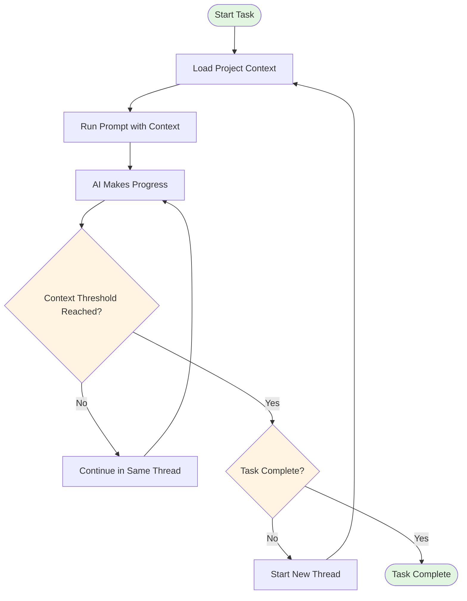
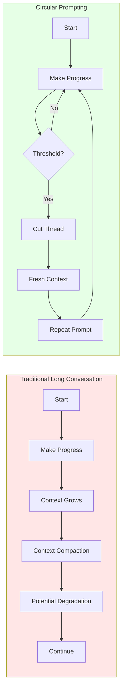

# Circular Prompting

This repo contains a collection of notes documenting a prompt engineering method that I am experimenting with and have been using for some time for long-running tasks as well as tasks that are open-ended in nature (like: codebase optimization and quality control). The tooling is typically an AI agent CLI (Claude, Open Code, etc). 

The method involves repetitively running the same prompt and cutting the conversation when a task completion has been completed. Some tasks defy traditional completion benchmarks: when can a UI be said to be at its most optimal and perfect state? So the completion endpoint - the finish line - only makes sense when using this for certain tasks where that yardstick is much easier to define. As an example of the latter: keep debugging until we have precisely zero Typescript errors and not one more! 

I use this everyday manually but the idealised and full implementation outlined in the planning document envisions delegating this decision-making to a planner agent responsible for cutting threads at completion checkpoints in order to prevent context degradation. 

This provides an alternative method to context compaction in order to maintain coherence over long tasks that challenge even the largest context windows.

## Core Concept

Instead of maintaining a single long conversation thread with context compaction, Circular Prompting involves:
- Running a prompt with context
- Allowing the AI to make progress
- Starting a new thread when context reaches a threshold (e.g., 60%)
- Repeating the same prompt to continue work
- Looping until the task is complete



### Comparison: Traditional vs Circular Prompting



## Use Cases

- **Project-specific**: Code remediation, refactoring, bug fixing with project context
- **Evergreen**: Code quality reviews, legacy code detection, general codebase analysis

## Advantages

- Avoids context degradation from conversation compaction
- Maintains fresh context in each iteration
- Clear success criteria (AI reports "no work left to do")
- Can be automated via a planning agent

## Example

```
Iteration 1: Prompt + Context → Progress → Stop at 60% context
Iteration 2: Same Prompt + Context → More Progress → Stop at 60% context
Iteration 3: Same Prompt + Context → Complete → "No work left to do"
```

## Documentation

See [`idea/notes/`](idea/notes/) for detailed transcripts and analysis of the concept.
